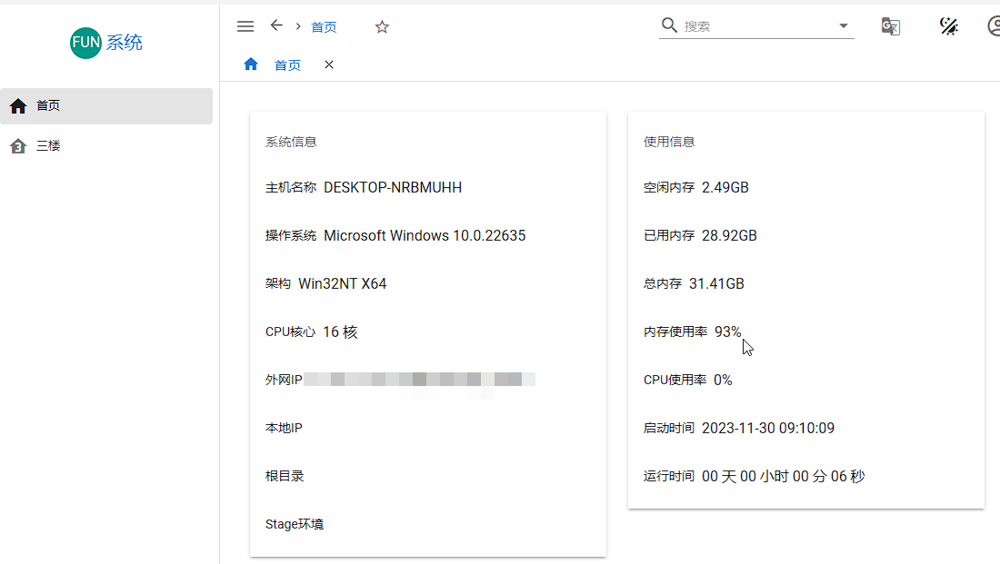

# BlazorAll

blazorAll前端是一个用Blazor构建的.net6 Hybird系统,，包含BlazorApp(MAUI跨平台APP)、BlazorClient(WASM客户端模式，通过API调用逻辑)、BlazorSSR(服务端模式，支持.NET全部功能)、BlazorWpf(WPF客户端)，开发速度快，并同时可以编译在各个平台运行。

前端引用了MasaBlazor(和MudBlazor)双重框架，控件用法直接百度。

所有系统界面和控件在BlazorShared中，编写业务界面需要新建程序集来开发，可以参考ECS.Pages项目。

1. 新建界面程序集 Project Sdk="Microsoft.NET.Sdk.Razor"，需要引用BlazorShared项目，程序集中写界面和逻辑。
2. 启动项目(BlazorSSR等)需要引用该项目，并且在服务注册代码中指定程序集名称和加入服务


```csharp
GlobalVariables.PageAssemblies = new List<string>
{
    "ECS.Pages"
};
// 添加页面单独的服务
builder.Services.AddEcsPageServices();
```

# 1、系统模式

系统分为独立平台和非独立平台（依赖AdminCore后台API服务）(https://github.com/strongQ/AdminCode)，通过各个平台配置文件(appsettings.json)中的SingleApp=true来切换。

## 1.1、独立平台



独立平台非API调用需要考虑Maui的兼容性。

独立平台目前只支持1级菜单，新建页面后只需要加上Page特性就行了，无需其他设置。

```csharp
@page "/ecs/floor1"
@using Masa.Blazor
@using GeneralCommon.Extensions
@using GeneralCommon.Enums
@using Microsoft.AspNetCore.Authorization
@using BlazorShared.Layout
@using ECS.Pages.Components
@layout BlazorShared.Shared.MainLayout
@inherits CultureComponentBase
@attribute [Authorize]
@using GeneralCommon.Attributes
@attribute [Page("/ecs/floor1", "一楼", "mdi-home-floor-1", true)]
```

## 1.2、非独立平台


非独立平台内置Admin.NET前端界面，通过API调用后台接口。

# 2、功能开发

## 2.1、查询界面开发


可以参考操作日志（OpLogListPage.razor）界面，简单的增删改查很简单实现。

1. 首先确定列表Model和查询Model，如AddLogInput和PageLogInput，在列表Model的属性中加上列名和展示属性

```csharp
/// <summary>
 /// 显示名称,显示列名
 ///</summary>
 [HeadDescription("显示名称")]   
 public string? DisplayTitle { get; set; }

 /// <summary>
 /// 请求方式，详情显示名称
 /// </summary>
 [Description("请求方式")]
 public string? HttpMethod { get; set; }
```

1. 界面中添加AddDataTable列表控件，详细属性请看代码（包含导入导出）。QueryCall是分页查询时调用（QueryListCall是不分页查询调用），EditCall时编辑保存调用，DeleteCall是删除时调用。

```csharp
<AppDataTable @ref="_table" TItem="AddLogInput" SearchItem="PageLogInput"
                  AddItem="AddLogInput" EditItem="AddLogInput" SearchModel="@SearchInput"
                  QueryCall="QueryCall" 
                        IsShowClearSearch
                   SearchItemFilter="SearchFilter"
                   ShowSelect="false"
                        ShowQueryButton
                        ShowDetailButton
                  ShowExportButton
                        IsShowSearchKey>

       @* 查询控件 *@
        <SearchTemplate>
<BlazorShared.Components.DateTime.MDateTimeControl Label="开始时间" @bind-Time="context.StartTime"></BlazorShared.Components.DateTime.MDateTimeControl>
<BlazorShared.Components.DateTime.MDateTimeControl Label="结束时间" @bind-Time="context.EndTime"></BlazorShared.Components.DateTime.MDateTimeControl>
        </SearchTemplate>

    </AppDataTable>
```

3、界面后台实现各个调用方法

```csharp
#region 通用Table代码
private AppDataTable<AddDictTypeInput, PageDictTypeInput, AddDictTypeInput, AddDictTypeInput> _table;

[Inject]
public IUserConfig UserConfig { get; set; }
[Inject]
public IDictManager DictManager { get; set; }

/// <summary>
/// 查询
/// </summary>
public PageDictTypeInput SearchInput { get; set; } = new PageDictTypeInput();

/// <summary>
/// 查询数据
/// </summary>
/// <param name="input"></param>
/// <returns></returns>
private async Task<SqlSugarPagedList<AddDictTypeInput>> QueryCall(PageDictTypeInput input)
{
    var result = await DictManager.GetTypePageData(input);
    return result.GetResult();
}

/// <summary>
/// 删除
/// </summary>
/// <param name="users"></param>
/// <returns></returns>
private async Task DeleteTypeCall(IEnumerable<AddDictTypeInput> menus)
{
    var result = await DictManager.DeleteDictType(new DeleteDictTypeInput
    {
        Id = menus.FirstOrDefault().Id
    });
    result.ShowMessage(PopupService);
}
/// <summary>
/// 编辑
/// </summary>
/// <param name="user"></param>
/// <returns></returns>
private async Task EditTypeCall(AddDictTypeInput data)
{
    var update = data.Adapt<UpdateDictTypeInput>();
    var result = await DictManager.UpdateDictType(update);
    result.ShowMessage(PopupService);
}

/// <summary>
/// 快速搜索
/// </summary>
/// <param name="search"></param>
/// <param name="item"></param>
/// <returns></returns>
public bool SearchFilter(string search, AddDictTypeInput item)
{
    if (search.IsNotNullOrEmpty() && item.Name != null)
    {
        return item.Name.Contains(search);
    }

    return false;

}

#endregion
```